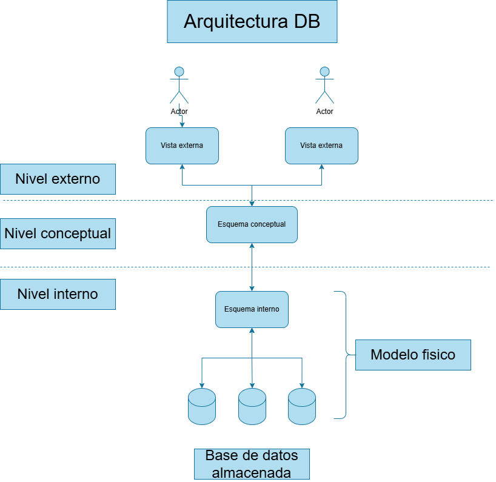

# Introduccion a Base de Datos

- Lenoardo Carámbula
- eMail: leonardocarambula@gmail.com
- 4 horas semanales (18:00 a 20:50)

# Marzo / Abril

- Introduccion a conceptos básicos
  - BD (Base de datos)
  - SGBD
  - SBD
- Modelo Conceptual
  - D. E-R.
- Evaluación: 27/04

# Mayo / Junio

- Modelo Conceptual
  - D. E-R. (continuación)
  - Restricciones
    - Estructurales y No Estructurales
    - De Integridad Referencial
- Modelo Lógico
  - Esquema Relacional
    - Pasaje a Tablas
- Evaluación: 22/06

# Julio / Agosto

- Modelo lógico
  - E. R. - Normalización
- Modelo físico
  - Instalación de MySQL
  - D.D.L. - Lenguaje de definición
  - D.M.L. - Lenguaje de manipulación
- Evaluación: 17/08

# Setiembre / Octubre

- S.Q.L: consultar datos
- EvaluaciónÑ 19/10

# Noviembre

- Obligatorio final
  - Individual o en grupo (máximo tres estudiantes)
  - Entrega: 9/11
  - Defensa 16/11

# Base de Datos

## Definición

- Un conjunto de datos relacionados entre si y almacenados por un prolongado periodo de tiempo.
  - representan algún aspecto del mundo real
  - almacenan un conjunto de datos coherentes
  - diseñadas y construidas con datos específicos

## Elementos que la componen

- Esquema:
  - Descripción de los datos y las relaciones entre los mismos
  - Cambia muy poco con el tiempo
- Instancia
  - El conjunto de datos de la base en un instante dado de tiempo
  - Cambia con cada inserción, borrado o modificación que se realice

# SGDB (DBMS)

- SGBD
  - Sistema Gestor de Base de Datos
- DBMS
  - Data Base Management System
  - Software especializado en la administración de base de datos
  - Ejemplos:
    - MariaDB
    - MySQL
    - Oracle
    - SQL Server

# Modelo de Datos

- Clasificación:
  - Modelos Conceptuales (M.E-R)
    - Orientados a la definición de estructuras y restricciones.
    - Utilizados para el diseño conceptual
    - Independiente al S.G.B.D. a utilizar
  - Modelos lógicos (M.R)
    - Orientados en la implementación y las operaciones
    - Utilizados para la implementación de la DB
  - Modelos físicos
    - Estructuras de datos sobres las que se implementan las otras
    - Utilizadas dentro de los gestores (SGDB), con relativamente poco control desde afuera de los mismos

# Lenguajes de especificación de base de datos

- Tiene tres lenguajes básicos
  - DDL (Data Definition Languages)
  - DML (Data Manipulation Language)
  - SQL (Structured Query Language)

> Lista

_Tabla, elemento fundamental en la DB_

| CI        | Nombre              | Edad | Grupo | Turno  |
| --------- | ------------------- | ---- | ----- | ------ |
| 123456789 | Valentina Rodríguez | 20   | A     | Mañana |
| 456789123 | Matías Fernández    | 22   | B     | Tarde  |
| 987654321 | Lucía Martínez      | 19   | A     | Noche  |
| 321654987 | Sebastián López     | 23   | C     | Mañana |
| 654123789 | Camila García       | 21   | B     | Tarde  |
| 789321654 | Nicolás Pérez       | 20   | C     | Noche  |
| 147258369 | Florencia Torres    | 24   | A     | Mañana |
| 369147258 | Andrés Díaz         | 19   | B     | Tarde  |

> Fila (tupla)
>
> | 123456789 | Valentina Rodríguez | 20 | A | Mañana |

> Columna (atributo)
>
> | CI |

Para evitar redundancia es recomendado dividir la tabla en otras más pequeñas.

> Estudiantes

| CI        | Nombre              | Edad |
| --------- | ------------------- | ---- |
| 123456789 | Valentina Rodríguez | 20   |
| 456789123 | Matías Fernández    | 22   |
| 987654321 | Lucía Martínez      | 19   |
| 321654987 | Sebastián López     | 23   |
| 654123789 | Camila García       | 21   |
| 789321654 | Nicolás Pérez       | 20   |
| 147258369 | Florencia Torres    | 24   |
| 369147258 | Andrés Díaz         | 19   |

> Grupo

| Nombre | Turno  |
| ------ | ------ |
| A      | Mañana |
| B      | Tarde  |
| A      | Noche  |
| C      | Mañana |
| B      | Tarde  |
| C      | Noche  |
| A      | Mañana |
| B      | Tarde  |

> List (mejorada)

| CI        | Grupo |
| --------- | ----- |
| 123456789 | A     |
| 456789123 | B     |
| 987654321 | A     |
| 321654987 | C     |
| 654123789 | B     |
| 789321654 | C     |
| 147258369 | A     |
| 369147258 | B     |

# Arquitectura DB

  

# Prueba diagnostica

1. Que es un conjunto?
2. Dado el conjunto de los números naturales enteros que 8
   1. Determina el conjunto por extension
   2. Determina un conjunto por comprensión
3. Defina unión de conjuntos
4. Defina intersección de conjuntos
5. Defina diferencia o resta de conjuntos
6. Defina producto cartesiano
7. Dado los siguientes conjuntos A y B

   A = { 1, 3, 5, 7 } \
   B = { 1, 2, 3 }
   1. A ∪ B
   2. A ∩ B
   3. A - B (diferencia)
   4. A x B (producto cartesiano)

---

1. Agrupación, colección o clase de objetos del mismo tipo, denominados elementos del conjunto.
2. 1. A = { 0?, 1, 2, 3, 4, 5, 6, 7 }
   2. B = $\{x \in \mathbb{N} \mid x < 8\}$
3. A ∪ B
4. A ∩ B
5. A - B
6. Es la combinación de A con cada elemento B
7. 1. A ∪ B = { 1, 2, 3, 5, 7 }
   2. A ∩ B = { 1, 3 }
   3. A - B = { 5, 7 }
   4. A x B = { (1,1), (1,2), (1,3), (3,1), (3,2), (3,3), (5,1), (5,2), (5,3) }
