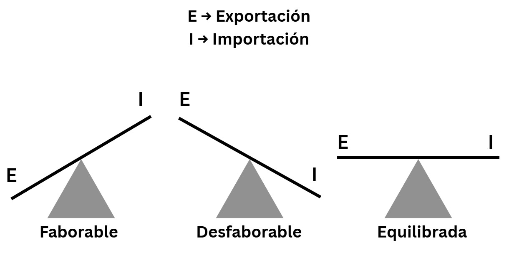

Profesor Gabriel Arbuet

> [!NOTE]
>
> **1860** - Revolución del lanar, cruce entre razas y se explotan las lanas.
>
> **1876** - Transformación de Lorenzo la Torre - Asociación Rural del Uruguay.
>
> **1870** - Se inaugura la Asociación Rural del Uruguay.
>
> **1903 - 1929** - Periodo Batllismo.
>
> - 1903 - 1907 1er Periodo José Batlle y Ordóñez.
> - 1911 - 1915 2do Periodo José Battle y Ordóñez.
>
> Presidentes Batlle.
>
> - Lorenzo Batlle Grau (1868-1872)
> - José Batlle y Ordóñez (1903-1907 y 1911-1915)
> - Luis Batlle Berres (1947-1951)
> - Jorge Batlle Ibáñez (2000-2005)
>
> 31 de marzo de 1933 - Golpe de estado Gabriel Terra
>
> 1942 - Segundo golpe de estado
>
> 1960 - Situación económica del Uruguay
>
> La iglesia católica enemigo permanente de los Batllistas
>
> 1886 - el diario del dia (formato sabana) creado por Batlle
>
> Segundo Batllismo - Reflota ideas del tio
>
> 1964 - Rumores de golpe de estado en Uruguay
>
> 1954 - Derrocan Estado en Guatemala
>
> Series de golpes de estados guiados por la doctrina de los Estados Unidos

# Definición de historia

_La historia es el único instrumento que puede abrir las puertas al conocimiento del mundo de una manera sino científica, por lo menos razonada_ - Pierre Vilar

# 2da definición de historia

_Quien no sienta la alegría infinita de estar aquí en este mundo revuelto y cambiante, peligroso y bello, sangriento y doloroso como un parto, pero como un creador de nueva vida, está incapacitado para escribir historia_ - Manuel Moreno Fraginals

> [!NOTE]
>
> Marx y Engels
>
> Marx - judío con problemas económicos
>
> Engels - judío multimillonario

> [!WARNING]
>
> Pedir definición de Marx y Engels
>
> _Marx y Engels con el... economista sistema que la historia de la humanidad es la historia de la lucha de clases. Hombres libre y esclavos, patricios y plebeyos, señores y siervos,... y oficiales, burgueses y proletariados, opresores y oprimidos se han enfrentado siempre algunas veces frente a frente y otras de maneras veladas_

> [!NOTE]
>
> **Siervos** - feudalismo
> El feudal dividía las tierras a los siervos y luego les tenían que retribuir con las producciones de esas tierras.

# Conceptos teóricos

## Economía

Es el conjunto de fenómenos relativos a la producción, distribución y consumo de bienes y servicios que son escasos y finitos.

## Imperialismo

Es el predominio de un país sobre otro. Puede ser total en lo político, en lo económico y en lo social o parcial en lo político y/o económico.

## Balanza comercial

Es la diferencia entre las exportaciones y las importaciones.
Pueden ser favorable, desfavorable o equilibrada.

  

