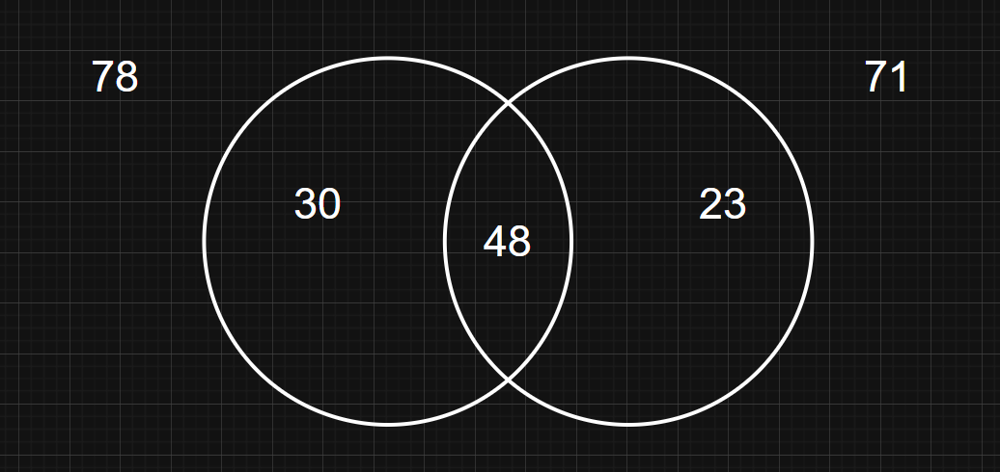

# Criterios de evaluación de la materia

- Asistencia
- Cuaderno completo
- Trabajo en clase
  - Oral
  - Escrito
- Escritos
- Carpeta o cuaderno práctico
- Deberes

# Acertijos

## El investigador

> _Lo que sigue es el fragmento de un informe presentado por un investigador a una conocida agencia de análisis de mercado que trabaja con estándares de precisión tan altos que el primer error de un empleado también es el ultimo._

| Numero de...               | Cantidad |
| -------------------------- | -------- |
| consumidores entrevistados | 100      |
| los que toman café         | 78       |
| los que toman té           | 71       |
| los que toman café y té    | 48       |

**porque despidieron al investigador?**

Solo toman café

78 - 48 = 30

Solo toman té

71 - 48 = 23

  

Porque si sumamos 30 + 48 + 23 = 101

El error está en el informe en el total de los entrevistados, presenta 101 en lugar de 100.

## El camión grande

> _Estas conduciendo un camión de 20 toneladas y 6m de altura. De repente te quedas atascado frente a un puente que tiene una altura máxima admitida de 5.98m._
>
> _La carga que llevas es urgente y caduca, imaginemos un cargamento del eche. Tienes que pasar necesariamente al otro lado del puente. Cerca de este hay tiendas donde venden sierras, taladros, pulidoras y otras herramientas. Cual es la solución más rápida?_

**Bajar la suspensión del camión desinflando un poco las ruedas**
