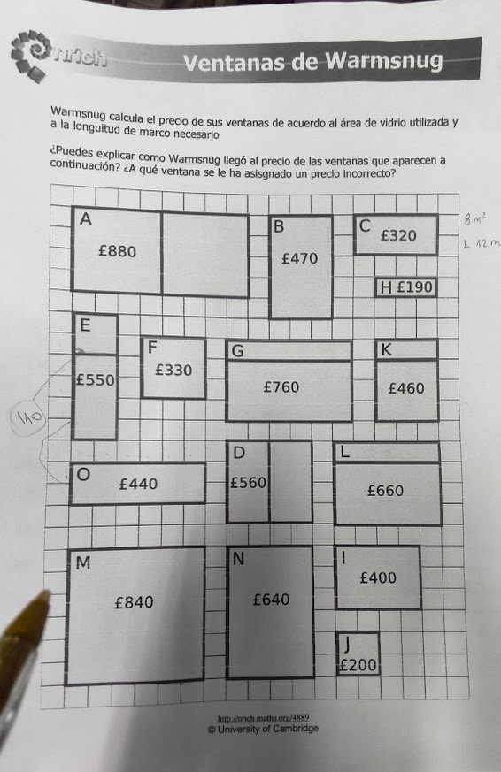

# Ejercicio Ventanas de Warmsnug

  

## Sistemas de ecuaciones

$x = m^2$ de vidrio

$y = m$ de marco

$$
\begin{array}{ll}
\begin{array}{l}
j \rightarrow \\
c \rightarrow
\end{array}
\left\{
\begin{array}{r}
4x + 8y = 200 \\
8x + 12y  = 320
\end{array}
\right.
\end{array}
$$

### Método de reducción

$$
j \rightarrow 4x + 8y = 200 \\
e \rightarrow 3x + 8y = 190
$$

$$
\begin{array}{r}
4x + \bcancel{8y} & = & 200 \\
-3x - \bcancel{8y} & = & -190 \\
\hline
x & = & 10
\end{array}
$$

### Sistema clásico de ecuaciones

$$
\left\{
\begin{array}{r}
4x + 8y & = & 200 & (-x2) \\
8x + 12y & = & 320
\end{array}
\right.
$$

$$
\begin{array}{r}
\bcancel{-8x} - 16y & = & 400 \\
\bcancel{8x} + 12y & = & 320 \\
\hline
-4y & = & -80 \\
y & = & 20 \\

\\

4x + 4*20 & = & 200 \\
4x + 160 & = & 200 \\
4x & = & 40 \\
x & = & 10 \\

\\

x & = & 10 \\
y & = & 20
\end{array}
$$

> [!NOTE]
>
> Método de Cramer - Buscar información
>
> 

# Ejercicio de cumpleaños

  

